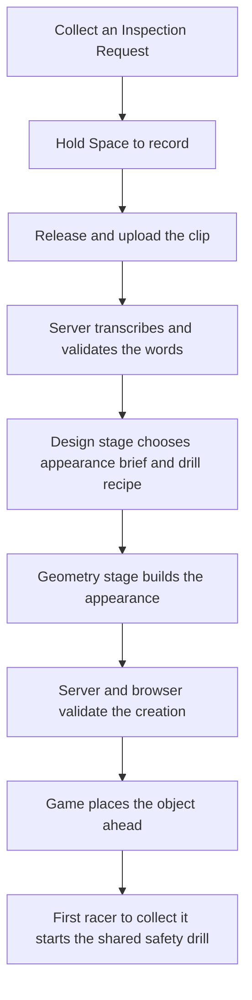

# How the game works

Start with [the README](../README.md) to play or run the game. This guide is a tour of the code for someone joining the project; detailed API and physics parameters are linked at the end.

## Three parts of one application

The browser runs the race and draws the scene. A small server handles requests that need an API key. A shared package defines the data they exchange so both sides can reject an invalid creation.

| Workspace | Role | Main tools |
| --- | --- | --- |
| `apps/web` | Menus, 3D rendering, player controls, race simulation, and microphone capture | React, Vite, React Three Fiber / Three.js |
| `apps/server` | HTTP API, speech transcription, generation stages, validation, and paid-attempt limits | Node.js, Fastify, OpenAI SDK |
| `packages/shared` | Validated data formats, inferred TypeScript types, fixtures, and event presets | Zod, TypeScript |

Bun installs dependencies and runs workspace scripts. The backend and test runner execute on Node. `bun run dev` starts Vite on port 5173 and Fastify on port 3001, with a watcher for the shared package. Vite forwards `/api` requests to Fastify. If you change the backend port, update the proxy in `apps/web/vite.config.ts` too.

Rivals are simulated in the browser. There is no multiplayer server, database, or player account system. Hosting access controls, when enabled, belong to Vercel rather than game code.

## Follow one voice creation

The race continues during recording and generation. A normal voice-enabled run offers two voice stars if the player reaches their locations, each granting one fresh attempt. The second is fixed at a randomly chosen depth between 60% and 70% of the course, independently of the first attempt's outcome or generated event. Collecting it saves its grant while earlier voice work finishes; a waiting object or active effect does not block its request. A slow request can still finish too late to place before landing. An empty transcript, more than ten words, a timeout, or cancellation ends that attempt; there is no automatic retry or encore.

In live mode, transcription uses a recorded clip. The design model writes a visual brief and a bounded drill recipe: a supported formation, force interaction, replay pattern, or inspection behavior with compatible options. Explicit behavior is honored when supported; omitted behavior is inferred. Authored rules supply strengths, durations and collision bounds. The geometry model receives only the visual brief. Models return structured data, and the browser renders only a completed, validated result.

Mock mode takes the same route through the application using prepared text and creations. It does not understand the recording. This lets contributors check the interaction without paying for speech or generation.

The generated object and the Voice Power Up are different things. The star grants permission to ask; the generated object waits to be collected. Its effect can reach every active racer, including its creator and the racer who triggers it. A creation already in the world remains available to other racers after its creator passes it or finishes.

## Where to change things

| Area | Entry points | Responsibility |
| --- | --- | --- |
| Main game page | `apps/web/src/pages/GamePage.tsx`, `game/MovementTest.tsx` | Personnel selection, setup, countdown, keyboard actions, and race UI |
| Simulation and movement | `game/RaceScene.tsx`, `practice-race.ts`, `freefall-controller.ts` | One fixed-step clock; movement, opponents, items, and finish state |
| World and characters | `game/race-course.ts`, `RaceObjects.tsx`, `GregModel.tsx`, `scripts/build-greg.py` | Course geometry, rendering, and reproducible dinosaur assets |
| Speaking attempt | `game/race-event-host.ts`, `creation-attempt.ts`, `voice/RaceVoiceControls.tsx` | Two-star scheduling, individual attempts, setup, cancellation, and queued spawning |
| Microphone and client | `voice/recorder.ts`, `safety-drill-voice-client.ts`, `race-events/drill-client.ts` | Capture audio, request transcription/generation, and validate progress/results |
| Shared effects | `apps/web/src/race-events/runtime.ts`, `bridge.ts`, `RaceEventRenderer.tsx` | Resolve collection, calculate effects for racers, and draw feedback |
| Server pipeline | `apps/server/src/generation/pipeline.ts`, `apps/server/src/generation/stage-transport.ts`, `apps/server/src/voice/routes.ts`, `apps/server/src/voice/transcription.ts` | Shared paid admission, transcription, design, geometry, and request cleanup |
| Hosting | `vercel.json`, `apps/server/src/vercel.ts`, `apps/server/src/hosted.ts` | Route frontend/API traffic and explicitly enable production AI |

Web paths abbreviated as `game/...` or `voice/...` are under `apps/web/src`.

Pre-race setup opens with a short guided briefing: the current steering, boost, and item bindings are shown as large keycaps, with braking and the remaining bindings under **All controls**. Players can start immediately without voice, using the selected prepared drill, or open a separate hazard-reporting step for mode and microphone setup. The entire setup reflows and scrolls as one surface on smaller displays; returning from hazard setup releases the microphone.

`MovementTest` is a historical name for the current main game. `CreationDemoPage`, `DemoGame`, `PlayerController`, and the v2 `RaceCreationHost` remain as older integration/regression code; they are not the page mounted by `GamePage`.

## Movement, appearance, and effects

`RaceScene` owns the sole 120 Hz simulation clock. During a race step, `RaceEventBridge` obtains forces, one-shot impulses, and obstacle protection from the event runtime. The normal racer controllers apply them while updating movement, then the bridge checks the movement segments for contacts. Rendering and microphone callbacks never integrate movement themselves.

V4 safety drills support herds, rapids, pinball bumpers, buddy tethers, orbital slingshots, flight-path echoes, and watchful inspectors. The `SafetyDrillRuntime` facade dispatches to focused mechanic modules. `DrillRenderer.tsx` and `MechanicRenderer.tsx` draw the same contact/force volumes the runtime uses and instance the generated mesh. Rivals consider hazards, useful currents, buddy tension, orbit entries, and inspection cones at their existing decision cadence. Recipe validation also supplies the provider recipe schema; titles and instructions share typed presentation tables. Text and voice streams reuse common envelope schemas while retaining strict version-specific payloads. See [adding actions](safety-drills.md#adding-actions-without-rebuilding-the-pipeline) for the concrete extension path. The original v3 gravity vortex, debris storm, shockwave and safe slipstream remain available for regression testing. Ordinary inventory items are a separate mechanic and keep their own timers and rules.

Generated appearance can be a recipe of boxes, spheres, cylinders, and cones, or an experimental list of vertices and triangles. The browser compiles a primitive recipe into one mesh. Neither format contains executable code or collision settings.

Game coordinates are measured in meters, with +Y up and falling toward -Y. Generated model coordinates are local to the object: +X right, +Y up, +Z toward its front; rotations use XYZ Euler radians. The renderer fits the model for gameplay, while the game sets an independent 10 m collection radius. A bigger model therefore does not secretly get a bigger hitbox. See [visual bounds](prompt-to-mesh-pipeline.md#visual-contracts-and-rendering) for exact limits.

## Music and post-race inspection

`LaunchScreen.tsx` shows the Blender launch artwork through the shared `LaunchArtwork` renderer. Its camera reserves landscape below the characters for Commence Training; selecting personnel unmounts the title canvas. The original illustration remains in the development comparison view, while a loading wheel waits for the first 3D frame and an updated rendered still handles unavailable WebGL. Music and volume sit in a compact overlay within the scene. See [the launch-screen guide](launch-preview.md) for rebuilding assets.

`GameMusic.tsx` keeps playback mounted through screen changes. Music controls sit in the launch overlay and inside Game settings, outside the gameplay HUD. `music-player.ts` applies a 0.85 gain to Ready Aim Fire; menu and results music keep their usual level. Pause, hidden tabs, and microphone capture suspend playback.

The results screen opens `RaceCreations` to inspect the current run's generated models with drag, rotation, tilt, and zoom controls. `RaceEventHost.creations` retains both validated creations and their cumulative outcome snapshots through slot replacement and landing. It distinguishes waiting, activated, missed, and discarded creations, and continues reflecting other racers' effects after the player lands. Starting a new run or disposing the host clears this in-memory history; audio and transcripts are never included. Existing development replay remains separate.

## Which data contract should I use?

| Contract | Used for | Reference |
| --- | --- | --- |
| `SafetyDrillSpec` v4 | Current race and lab; one generated appearance and a composable drill recipe | [Safety drills](safety-drills.md) |
| `RaceEventCreation` v3 | Retained APIs and legacy shared-effect fixtures | [Shared race effects](race-events-handoff.md) |
| `CreationSpec` v2 | Lab's Asset generation comparison and retained creation demo; one effect in generated lab results | [Generation lab](prompt-to-mesh-pipeline.md), [legacy demo](creation-skeleton.md) |
| `PowerUpSpec` v1 | Original fixtures and compatible `/api/powerups` clients | [Legacy power-up API](legacy-powerups.md) |

The main race sends recorded prompts to `POST /api/voice/drills`. The event lab also supports text through `POST /api/lab/drills`. Both use `GET /api/lab/profiles` for available configurations. Those routes remain in production even though the lab UI is excluded from the production build.

Use the schema for the feature you are changing; do not cast a v3/v4 encounter into the older creation loop. Validate on both server and browser boundaries. Coordinate shared changes because gameplay and generation depend on the same package.

## Secrets, timing, and cleanup

A key belongs in the ignored `apps/server/.env` locally or a Vercel Secret when hosted. Only server code uses it. The browser receives profiles, progress, validated results, and safe errors. Key presence alone does not enable paid calls.

The application allows up to 8 seconds of recording, a separate 10 seconds for upload/transcription, then 30 seconds for generation. Design uses at most 8 seconds of that generation window; geometry gets the time left. A live voice attempt can make up to three API calls under one attempt ID and allowance entry. Clients add validated compatibility metadata automatically on deliberate submission in Live mode; there is no payment opt-in checkbox.

Pause, restart, finish, and navigation cancel pending race requests, discard saved voice grants and waiting results, and reject stale results. A pause preserves an uncollected future star. Audio is kept in memory for the request. Lab comparison history and the race's last-result replay are also in memory; neither stores audio.

Local live mode defaults to three attempts per server start. Hosted mode defaults to 500 per instance. These are temporary counters, not a durable or global spending cap. Read [voice setup](voice-input-plan.md#enable-live-ai-locally) or [deployment](deployment.md) before deliberately enabling paid calls.

## Read next

- [Contributing](../CONTRIBUTING.md): a focused change, checks, and review.
- [Voice guide](voice-input-plan.md): microphone setup and common failures.
- [Generation lab](prompt-to-mesh-pipeline.md): model profiles, comparisons, and wire formats.
- [Shared race effects](race-events-handoff.md): exact runtime interfaces and effect parameters.
- [Art guide](dinosaur-art-direction.md): characters, animation, and rebuilding assets.

### Race HUD readability

The final race HUD sizing rules live in `apps/web/src/game/race-hud.css`, loaded after the shared game styles. Main readouts use 16–22 px text, position uses 44–64 px, and held-item/boost/dodge controls use larger cards and explicit key badges. HUD edges follow the viewport width, including ultrawide screens. Container queries compact the layout for narrow or short windows. RaceAlertProvider routes screen messages into RaceAlertDock at the bottom: voice progress, drill instructions, generated-effect hit feedback, creation notices, and landing warnings. Ordinary item feedback and lock-on instructions stay directly above the left item card; missile threats remain at the top of the playfield. Wide layouts place the bounded, scrollable dock between item and boost cards; narrow layouts put it in a separate footer below the canvas. Urgent instructions take priority over decorative trophies. World-space target and pickup markers stay attached to their objects. Movement and screen-projected pickup/target positions are unchanged.

## Incident reports

The results viewer shows one incident report per creation: a headline, one or two measured facts, a departmental finding, and expandable inspection details. Authored findings appear immediately and remain provisional while racers are still falling. Prepared drills and development fixtures stay free.

`RaceReportController` owns report state outside the dialog. It freezes the racer-to-character mapping, waits for every racer to finish and voice cleanup to complete, and submits at most one batch containing the run's one or two voice creations. A separate report option in live setup starts off unchecked. It can be revoked in settings before dispatch. Closing the viewer preserves the run's reports; pause, reset, or navigation cancels pending work without a retry.

`packages/shared/src/race-reports.ts` owns strict compact contracts, canonical evidence, authored findings, and the input fingerprint. `race-report-input.ts` extracts only relevant final counters. The server's `race-reports` modules screen names, write one structured batch, validate its evidence references, and screen generated text. Factual sentences come from the application; AI supplies framing only. Schema validation cannot prove the truth of generated framing.

`POST /api/race-reports` and the read-only `GET /api/race-reports/status` are included in the game release. Reports share the creation pipeline's single paid slot and allowance, with one admission per run UUID. The report operation has a 12-second server budget and 15-second client budget. See [incident reports](race-incident-report-proposal.md) for contracts, limits, and verification.
